# DevsCodespace Backend Theme (`dcs_backend_theme`)

**Author:** Ankit · **Maintainer:** [DevsCodespace](https://devscodespace.com) ·
**License:** LGPL-3 · **Odoo:** 20.0 Community

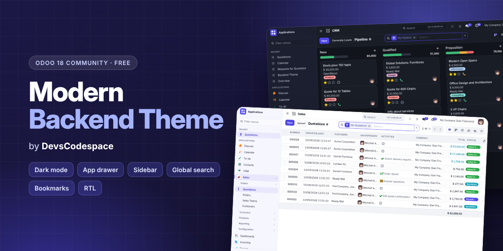

A configurable backend theme for **Odoo 20 Community**. It covers the same
feature areas as premium backend themes (sidebar, app drawer, dark mode, split
view, login layouts and more) with its own visual identity and an
implementation built on the Odoo 20 web client: OWL 3 components, services,
registries, small isolated `patch()` calls, and SCSS compiled into Odoo's own
light and dark bundles.

* Depends only on `web` and `mail` (`mail` is needed for the chatter-position
  option, and every business app already installs it).
* No Enterprise code, no jQuery, no third-party JS/CSS libraries, no external
  font requests.
* Preferences are stored per user on `res.users.settings`. They reach the
  browser inside the existing `session_info`, so start-up costs **no extra
  RPC**.

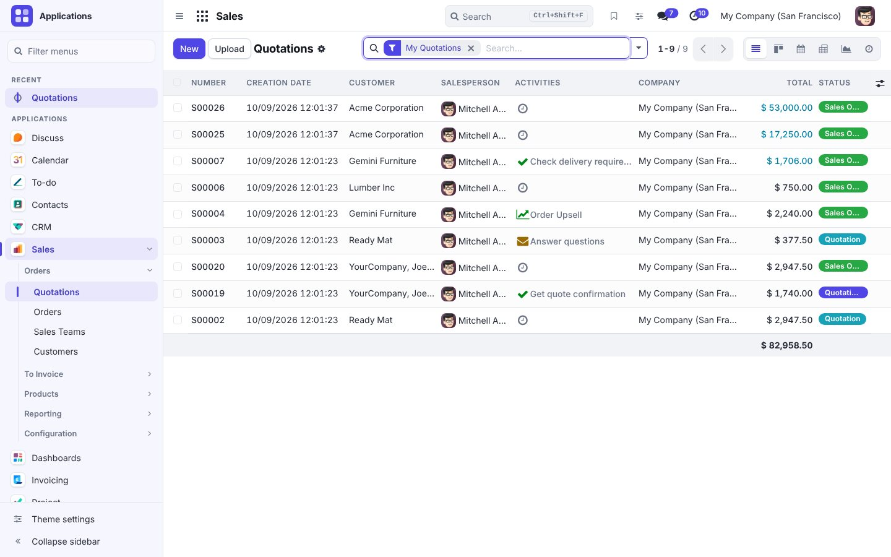

**Jump to:** [Feature tour](#feature-tour) · [Feature list](#features) ·
[Installation](#installation) · [Configuration](#configuration)

---

## Features

| Area | What you get |
|---|---|
| **Navigation** | Four modes: *Sidebar* (vertical), *Top bar* (horizontal, Odoo sections in the navbar), *Compact* (icon rail plus top-bar sections), *App drawer* (full-screen launcher). |
| **Sidebar** | Expanded, mini (icon rail with tooltips) or collapsed. Locked, or expands on hover when unlocked. Start or end position. Light, tinted or ink style. Nested menus, active indicator, filter box, favorite apps, recently used menus, full keyboard navigation (↑ ↓ Home End ← →). |
| **App drawer** | Search across apps *and* menus, favorites (★), recently used apps, grid / categories / list layouts, arrow-key navigation, Ctrl/⌘-click opens in a new tab. |
| **Global search** | `Ctrl+Shift+F` (or the search pill in the navbar). Fuzzy search over apps, menus and bookmarks, recent searches, suggestions, ARIA combobox. A final entry hands the query to Odoo's command palette for records and commands, so Odoo's search behavior is not replaced. |
| **Bookmarks** | Bookmark the current menu, view or record from the side panel, then rename, reorder or delete. Bookmarks sync across devices (stored server side). |
| **Theme modes** | Light, dark, or follow the system. Dark mode is a **recompiled bundle** with a designed palette, not a CSS filter. It covers forms, lists, kanban, dialogs, dropdowns, date pickers, chatter, notifications and more. |
| **Colors** | Eight palettes (indigo, blue, purple, green, teal, orange, red, slate) plus a custom color picker. Text on the primary color is chosen automatically for contrast. |
| **Typography & layout** | System UI, Roboto, Open Sans, Montserrat, Raleway or Tajawal (served locally from Odoo's `web` module). Four font sizes, four corner radii, three densities. |
| **Views** | Restyled control panel, search facets, pill statusbar, notebook tabs, smart buttons, sheet cards, list headers, hover and selection states, footers, kanban cards and columns, pivot, calendar and search panel. |
| **Split view** | Optional list + form side by side (screens ≥ 1200 px). Opening a row previews the form next to the list. Changes autosave when you switch rows, close the pane or leave the action, exactly like the standard form view. Falls back to standard behavior in dialogs, editable lists, lists with an open action, small screens and non-`act_window` actions. |
| **Chatter** | *Automatic* (Odoo's 1400 px rule, applied to the width left after the sidebar, so the sheet is never squeezed), *side* (from 1200 px) or *bottom*. Restyled message cards, composer, attachments and activities. |
| **Login page** | Minimal, corporate, split-screen or illustration layout. Logo, background (gradient, plain or image), colors, brand name, headline, text, footer and the "Powered by" toggle are all configurable without code. |
| **Motion** | Full, reduced or off. `prefers-reduced-motion` is always respected. |
| **RTL** | Logical CSS properties throughout, plus Odoo's rtlcss pass. Tested in Arabic. |
| **Responsive** | Below the `md` breakpoint the sidebar is not rendered and Odoo's own mobile UI (burger menu, bottom sheets) is left untouched. |

---

## Feature tour

Screenshots taken on Odoo 20.0 Community with demo data.

### Navigation: Four navigation modes, one click apart

Every user chooses how they move around Odoo. The choice is saved to their account and follows them to every device.

- **Sidebar**: all apps and nested menus on the side, with an active indicator
- **Top bar**: Odoo-style horizontal menus with a cleaner bar
- **Compact**: a slim icon rail plus top-bar menus, for maximum screen space
- **App drawer**: a full launcher for teams that prefer a home screen

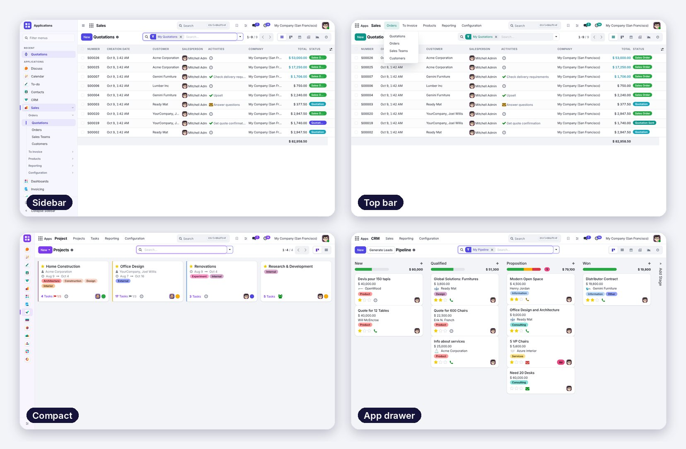
*Sidebar, top bar, compact and app drawer navigation*

### Sidebar: A sidebar that fits the way you work

Expanded, mini or collapsed; locked or expanding on hover; on the left or the right; light, tinted or dark ink.

- Filter menus as you type, with recently used menus at the top
- Mini mode shows app icons with tooltips
- Full keyboard navigation (arrows, Home, End)
- Mirrors automatically for right-to-left languages

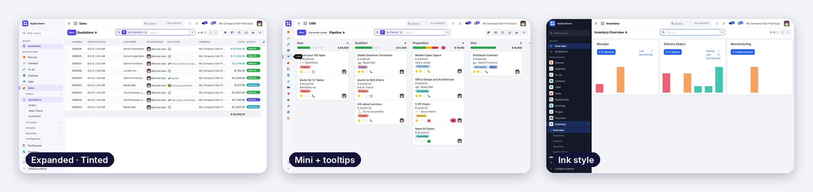
*Expanded tinted sidebar, mini sidebar with tooltips, and the dark ink style*

### App drawer: Find any app or menu instantly

The launcher searches apps *and* menus together, remembers what you used recently and lets you pin favorites.

- Grid, category or list layout
- Favorites and recently used apps
- Four app icon styles: original, rounded tile, circle or flat
- Arrow keys, Enter and Esc; Ctrl/⌘-click opens a new tab

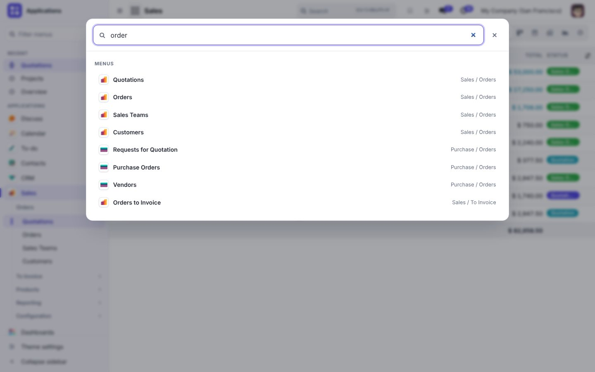
*Typing searches apps and every menu*

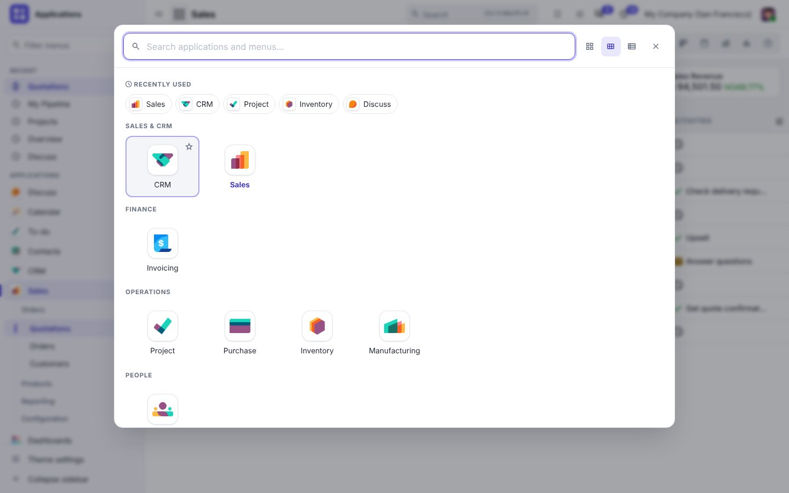
*Apps grouped by business area*

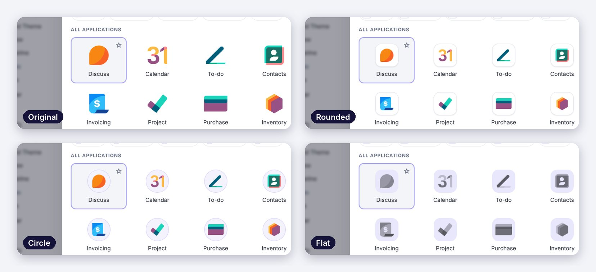
*Original, rounded, circle and flat app icons*

### Global search: Press Ctrl+Shift+F and go

A command-palette style search over apps, menus and bookmarks, with fuzzy matching, recent searches and suggestions.

- Works from anywhere in the backend
- Shows where each menu lives (App / Section)
- Hands record searches to Odoo's own command palette

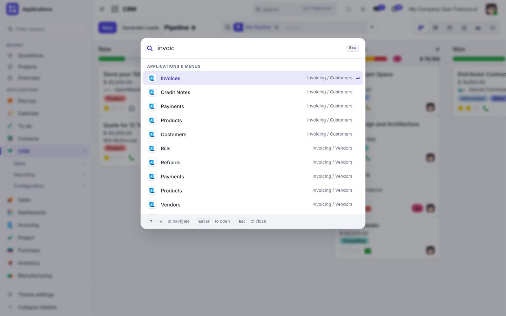
*Fuzzy search across apps and menus*

### Bookmarks: Bookmark the screens you use every day

Save menus, filtered views or individual records, then rename and reorder them. Bookmarks are stored on the server, so they follow you to every device.

- One click: “Bookmark this page”
- Records, views and menus
- Rename, reorder and delete

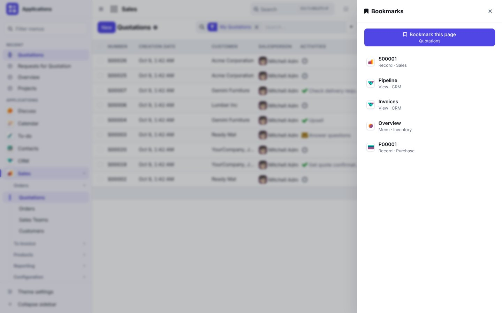
*The bookmarks panel*

### Dark mode: A real dark mode, designed rather than inverted

Dark mode is a separately compiled theme with its own palette, not a CSS filter. It covers every standard view, dialogs, dropdowns, date pickers, chatter and the theme's own panels.

- Light, dark or follow the operating system
- Readable contrast for text, badges and charts
- Works with every color palette

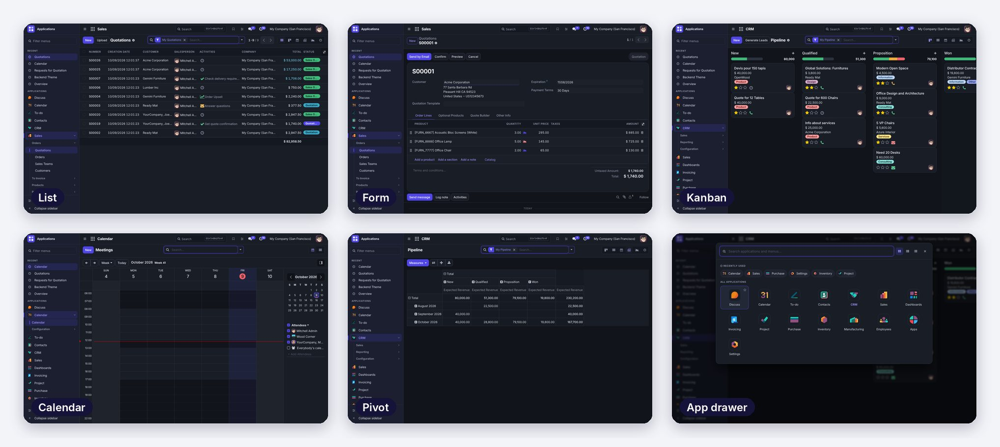
*List, form, kanban, calendar, pivot and app drawer in dark mode*

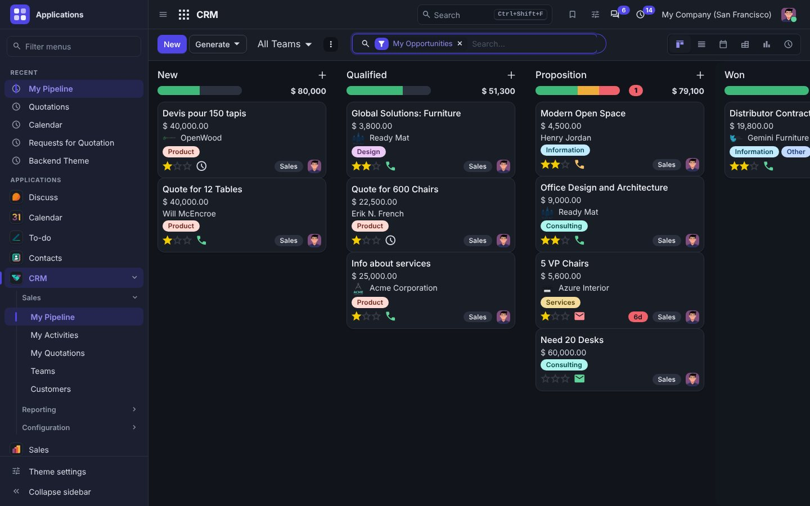
*CRM pipeline in dark mode*

### Colors & personalization: Make it yours in seconds

Eight curated palettes plus a custom color picker. Text on the primary color is chosen automatically for contrast. Every option applies instantly, with no page reload.

- Indigo, blue, purple, green, teal, orange, red and slate, plus any custom color
- Six fonts served locally (no external requests), four font sizes
- Corner radius, density and animation level (full, reduced or off)

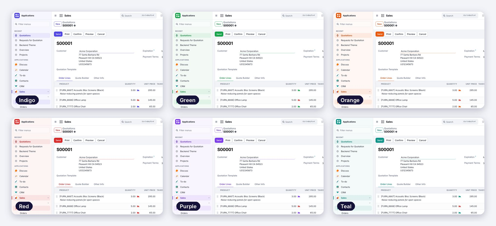
*Six of the built-in palettes*

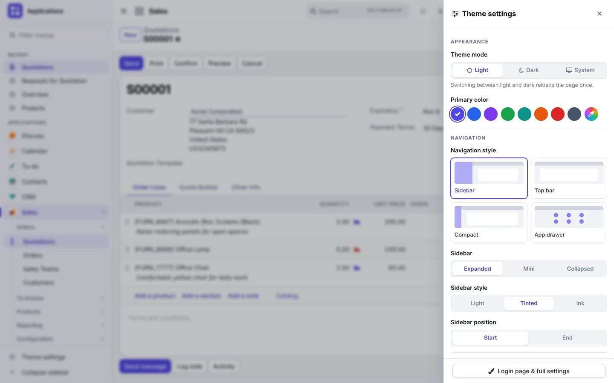
*The theme settings panel, one click from any screen*

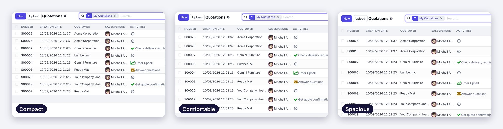
*Compact, comfortable and spacious density*

### Polished views: Every standard view, refined

Cleaner control panel, pill status bar, notebook tabs, sticky list headers, hover and selection states, modern kanban cards and a restyled chatter, without changing any business logic.

- List, form, kanban, calendar, pivot, graph and activity views
- Tested with Sales, CRM, Inventory, Purchase, Accounting, Manufacturing, Project, Employees and more

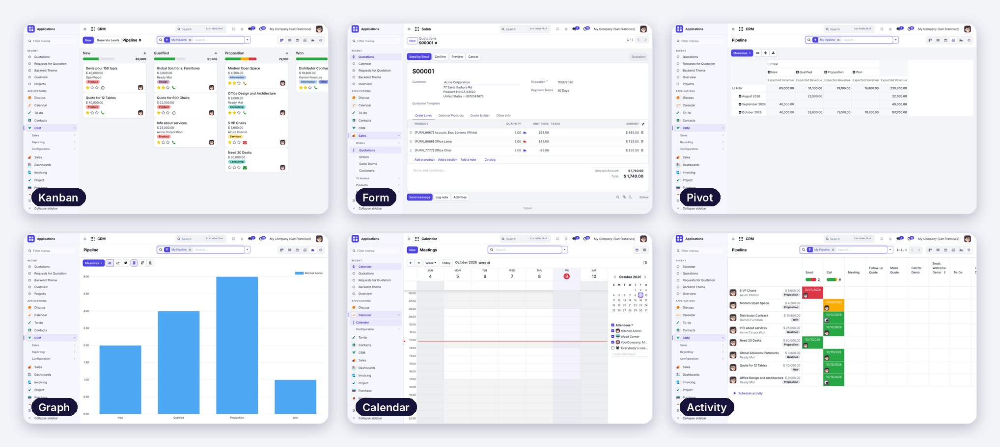
*Kanban, form, pivot, graph, calendar and activity views*

### Split view: List and form side by side

Turn on split view to open records next to the list. Changes are saved automatically when you switch rows, close the pane or leave the screen, exactly like a normal form.

- Keeps dashboards and search panels of each app
- Expand to the full form in one click
- Falls back to standard behavior on small screens and in dialogs

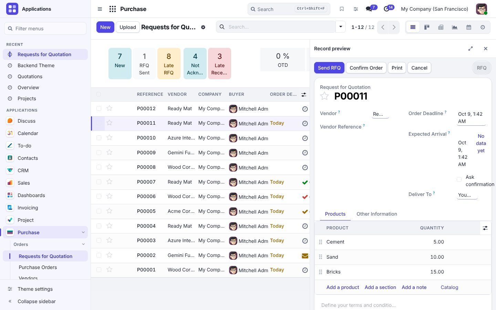
*Purchase RFQs with the selected record open beside the list*

### Chatter: Chatter where you want it

Automatic mode places the chatter beside the form when there is room (taking the sidebar into account) and below it otherwise. You can also force it to the side or the bottom.

- Restyled messages, composer, attachments and activities

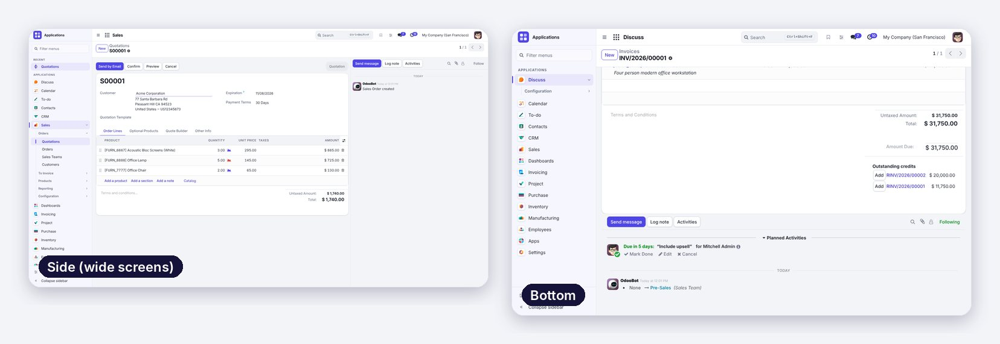
*Side chatter on a wide screen, bottom chatter on a form*

### Settings page: Everything in one settings page

Users manage their personal preferences. Administrators also brand the login page for the whole database.

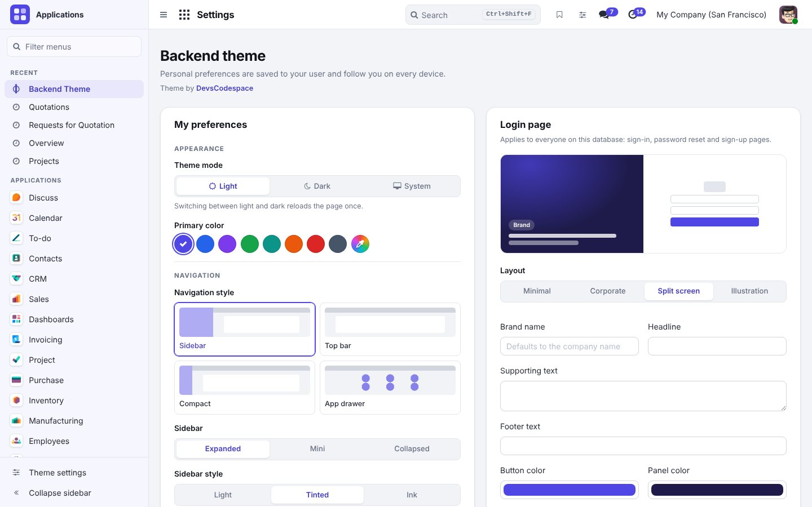
*Personal preferences and login page settings*

### Login page: A branded login page, without code

Choose between four layouts and set the logo, background (gradient, color or image), colors, brand name, headline, text and footer.

- Minimal, corporate, split-screen or illustration layout
- Applies to sign-in, password reset and sign-up pages
- No hard-coded branding: your company name by default

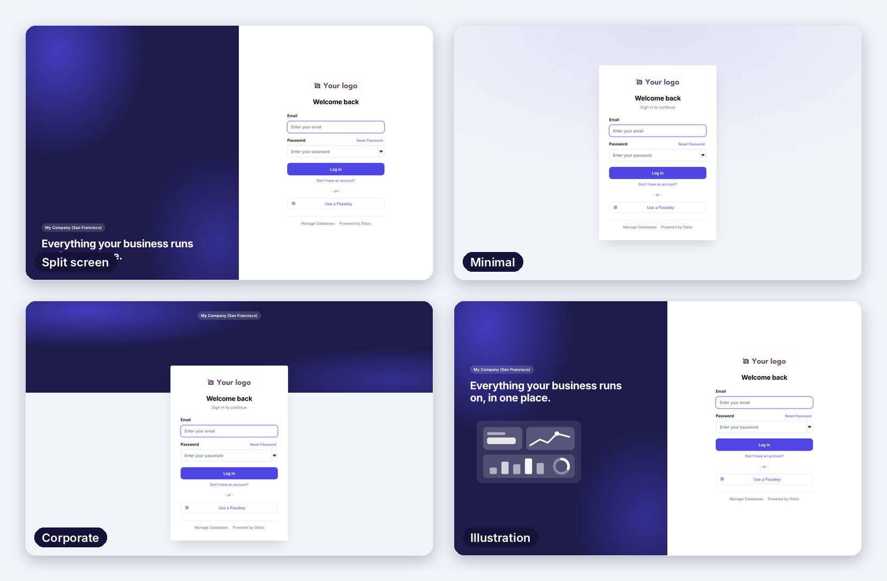
*The four login page layouts*

### RTL: Right-to-left languages, done properly

Built with logical CSS properties, so Arabic, Hebrew and Persian get a correctly mirrored layout, not a flipped page.

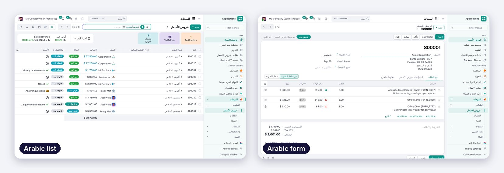
*Sales list and form in Arabic*

### Responsive: Desktop, tablet and phone

On phones the theme steps aside and keeps Odoo's own mobile navigation, with the theme's colors and polish.

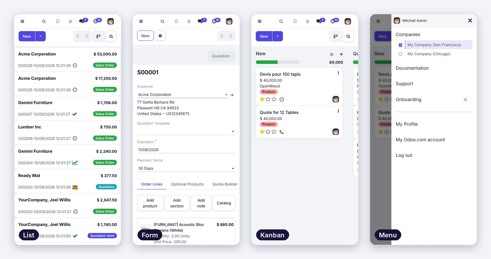
*List, form, kanban and menu on a phone*

---

## Installation

1. Copy `dcs_backend_theme/` into a directory on your `addons_path`.
2. Restart Odoo, enable developer mode, then go to **Apps → Update Apps List**.
3. Search for **DevsCodespace Backend Theme** and click **Install**.

Command line:

```bash
odoo-bin -d <db> -i dcs_backend_theme --stop-after-init
```

Every existing internal user gets a settings record at install time
(`post_init_hook`), so the first page load already carries the theme
defaults.

## Configuration

**Personal preferences (every user).** Use the ⚙ *sliders* icon in the navbar
or *Theme settings* at the bottom of the sidebar. Changes apply instantly and
are saved automatically. Only switching between light and dark reloads the
page once, because dark mode is a separately compiled bundle.

**Full page and login branding (administrators).** Go to *Settings → Backend
Theme*, or open `/odoo/theme-settings`. The login settings apply to the whole
database: sign-in, password reset and sign-up pages.

**Keyboard shortcuts.**

| Shortcut | Action |
|---|---|
| `Ctrl+Shift+F` (`⌘⇧F` on macOS) | Global search |
| `Alt+H` (Odoo hotkey overlay `H`) | App drawer |
| `↑ ↓ ← → Home End Enter Esc` | Navigate the sidebar, drawer and search |

---

## Architecture

```
dcs_backend_theme/
├── __manifest__.py            asset bundle wiring (light, dark, lazy, frontend, tests)
├── __init__.py                post_init / uninstall hooks
├── models/
│   ├── res_users_settings.py  per-user preferences (+ validation of JSON fields)
│   ├── ir_http.py             color_scheme(): picks Odoo's light or dark bundle
│   └── theme_config.py        login-page configuration (ir.config_parameter + public attachments)
├── data/theme_actions.xml     client action + Settings menu
├── views/login_templates.xml  inherits web.login_layout (the login form itself is untouched)
├── static/src/
│   ├── core/
│   │   ├── theme_service.js       "cbt_theme": prefs, persistence, color scheme, panels
│   │   ├── navigation_service.js  "cbt_nav": menu index, fuzzy search, recents, bookmarks
│   │   ├── constants.js / color_utils.js / use_panel.js (focus trap, Esc, focus restore)
│   ├── components/
│   │   ├── sidebar/           main component (fixed, offsets the web client with padding)
│   │   ├── app_drawer/  global_search/  bookmarks/  theme_settings/
│   │   ├── overlays/          lazy host: a panel is only instantiated while open
│   │   ├── systray/           search pill, bookmarks, settings buttons
│   │   └── app_icon/
│   ├── patches/               small, isolated patch() calls
│   │   ├── navbar_patch.*     apps dropdown → drawer launcher (desktop only)
│   │   ├── webclient_patch.js marks the real web client env
│   │   ├── list_split_view.*  ListController.openRecord / ListRenderer.getRowClass;
│   │   │                      pane hosted via a web.Layout extension (works for every
│   │   │                      ListController subclass and derived list template)
│   │   └── chatter_position.js FormRenderer.mailLayout / FormController.className
│   ├── scss/
│   │   ├── variables/primary_variables(.dark).scss   compile-time palettes
│   │   ├── tokens.scss        CSS custom properties (runtime primary, radius, density…)
│   │   └── ui/*.scss          per-area styling; dark_mode.dark.scss only in the dark bundle
│   └── login/login.scss       frontend bundle, scoped to .cbt-login
├── static/tests/              Hoot unit tests + a tour
└── tests/                     Python tests (models, assets, login page, tour, Hoot runner)
```

### Design decisions

* **No WebClient template override.** The sidebar and overlays are registered in
  the `main_components` registry and rendered only when
  `env.cbtInWebClient` is set (by a one-line `WebClient` patch). The layout
  is shifted with `padding-inline-start` on `<body>`, driven by
  `data-cbt-*` attributes on `<html>`. Odoo's flex layout, action manager and
  fullscreen mode keep working unchanged.
* **Runtime vs compile time.** Things users change often (primary color,
  radius, density, font, motion) are CSS custom properties, so there is no
  reload. Light and dark are two compiled bundles, which is how Odoo 20
  Community itself does dark mode: `ir.http.color_scheme()` picks
  `web.assets_web_dark` when it returns `"dark"`. The theme also writes
  Odoo's `color_scheme` cookie, which Odoo reads for lazy bundles and chart
  colors.
* **Bootstrap bridge.** Bootstrap's CSS variables use the `$prefix` Odoo
  configures, and the theme maps them to its own tokens, so utilities like
  `.text-primary` and `.btn-primary` follow the runtime color.
* **Persistence.** Writes go through the standard
  `res.users.settings.set_res_users_settings` RPC, debounced (600 ms). On
  `pagehide`, pending changes are sent with a `keepalive` request.
  Recents and search history are device-local conveniences kept in
  `localStorage`.
* **Patches are minimal and additive.** Each patch calls `super` and only
  changes behavior when the related preference is enabled.

### Extending

```js
import { useService } from "@web/core/utils/hooks";

// read or change preferences from any component
const theme = useService("cbt_theme");
theme.prefs.cbt_nav_mode;                    // reactive
await theme.setPref("cbt_density", "compact");
theme.openPanel("search");                   // "drawer" | "search" | "bookmarks" | "settings"

// navigation helpers
const nav = useService("cbt_nav");
nav.search("invoice");                       // fuzzy over apps, menus, bookmarks
nav.addCurrentPage();                        // bookmark the current view or record
```

To add a palette, extend `PALETTES` in `core/constants.js` and the
`cbt_palette` selection in `models/res_users_settings.py`. Translatable
strings use `_t()` / `env._()`, so the module can be translated through the
standard `i18n/*.po` workflow. A template is shipped in
`i18n/dcs_backend_theme.pot` (regenerate with
`odoo-bin i18n export -d <db> dcs_backend_theme -o i18n/dcs_backend_theme.pot`);
add e.g. `i18n/ar.po` to translate the theme's own labels.

---

## Tests

```bash
odoo-bin -d test_db -i dcs_backend_theme \
         --test-enable --test-tags=/dcs_backend_theme --stop-after-init
```

* `tests/test_preferences.py`: defaults are shipped in the session payload,
  updates use the standard RPC, isolation between users (record rules),
  validation of colors, selections, bookmarks and favorites, and
  `color_scheme()` for light, dark, system and portal users.
* `tests/test_login_config.py`: admin-only configuration, image upload,
  replacement and removal (no orphan attachments), input validation and
  escaping, and rendering of all four layouts on `/web/login`.
* `tests/test_assets.py`: every touched bundle compiles (light, dark, RTL,
  lazy, frontend), and dark-only rules never leak into the light bundle.
* `tests/test_ui.py`: an end-to-end tour in the real web client (sidebar,
  drawer, search via shortcut, bookmark persisted on the server, live
  settings, list/kanban switch) and the Hoot unit-test suite
  (`static/tests/*.test.js`: 20 tests covering services, preferences,
  sidebar, drawer, search keyboard handling, the settings form and the
  split view, including ListController subclasses).

The tour only uses apps available with the module's own dependencies
(Settings, Users), so the suite runs on a bare database. Browser tests need
Chromium and the `websocket-client` Python package.

**Results on Odoo 20.0 Community (branch `20.0`, commit `01d3c8a`, October 2026):**
18/18 Python tests (including the tour) and 20/20 Hoot tests pass on a fresh
database.

**Verified in a browser** with demo data for Sales, CRM, Inventory,
Purchase, Invoicing/Accounting, Manufacturing, Project, Employees, Contacts,
Calendar and Discuss: list, form, kanban, calendar, pivot, graph, activity,
search panel, settings and chatter, with no console errors, in light and
dark mode, all four navigation modes, Arabic (RTL), and 1440 px, 1024 px
tablet and 390 px phone widths. Uninstalling was verified to leave no
`cbt_*` columns, parameters, attachments, views or actions behind, with the
stock backend loading normally afterwards; reinstalling works.

---

## Odoo 20 compatibility notes

This is the **20.0** branch of the module. Odoo 20 moved the web client to
**OWL 3**, so the 20.0 code differs from 19.0 in these places:

* **Components and templates.** No `static props`; props are declared with
  `props = useProps({...})` and `t` types. State uses `proxy()` / signals
  instead of `useState` / `reactive`; refs are `signal.ref()` with
  `t-ref="this.rootRef"`. Templates reference component members as
  `this.x`, use `t-out` / `t-call-slot`, pass `t-call` parameters as
  attributes, and inputs bind values explicitly (OWL 3 `t-model` needs
  signals). `useLayoutEffect` / `useSubEnv` / `render` come from
  `@web/owl2/utils`.
* **Icons.** Font Awesome is no longer shipped; all icons use Odoo's icon
  system (`<i class="oi" data-icon="search"/>`, Material Symbols subset).
  App font icons (`web_icon` "name,color,background") render the same way.
* **UI size.** `SIZES` comes from `@web/core/ui/ui_utils`.
* **Server.** `ir.config_parameter` uses the typed API (`get_str` /
  `set_str`); `web.login_layout` passes `body_classname` as a `t-call`
  attribute.
* **Dark mode.** Odoo 20 dashboard cards (Sales) get dark tints through
  their `--DashboardCard__*` variables.
* Unchanged: `web.NavBar.AppsMenu`, `menu` / `action` services,
  `user.settings` / `set_res_users_settings`, `ir.http.color_scheme()`, the
  `web.assets_web_dark` bundles and mail `FormRenderer.mailLayout()`.
* **Odoo's own NavBar unit tests** expect the default apps dropdown, which
  this theme replaces with the drawer launcher; run Odoo's core suites on a
  database without the theme.

## Upgrade / migration notes

* **From the 19.0 version.** Data is compatible: the same `cbt_*` fields and
  `dcs_backend_theme.*` parameters are used, so a migrated database keeps
  every user preference, bookmark and the login page setup.
* **From 18.0 themes.** The field names (`cbt_*` on `res.users.settings`) are
  new, so nothing collides with other themes. Uninstall any other backend
  theme first: two themes patching the navbar will conflict.
* **Version bumps.** New preferences are added as fields with defaults, so
  existing users keep their settings. Asset changes only need a module
  update (`-u dcs_backend_theme`). Users may need one hard refresh if the
  browser cached the previous bundle.
* **Uninstall.** Odoo drops the `cbt_*` columns, and the `uninstall_hook`
  removes the login parameters (`dcs_backend_theme.*` in
  `ir.config_parameter`) and the uploaded logo or background attachments.
  The asset bundles recompile without the theme, `color_scheme()` returns to
  Odoo's default, and the backend is standard again. The only leftovers are
  browser-side: the `color_scheme` cookie, which the theme sets with a
  3-day lifetime so it expires on its own (until then, a user who was in
  dark mode gets dark chart and pivot colors), and the `cbt.*`
  `localStorage` keys for recents, which nothing reads any more.

## Support

Questions, customization or Odoo/Django development:
[devscodespace.com/contact](https://devscodespace.com/contact).

## License

LGPL-3. See `LICENSE`. Copyright 2026 Ankit, DevsCodespace.
